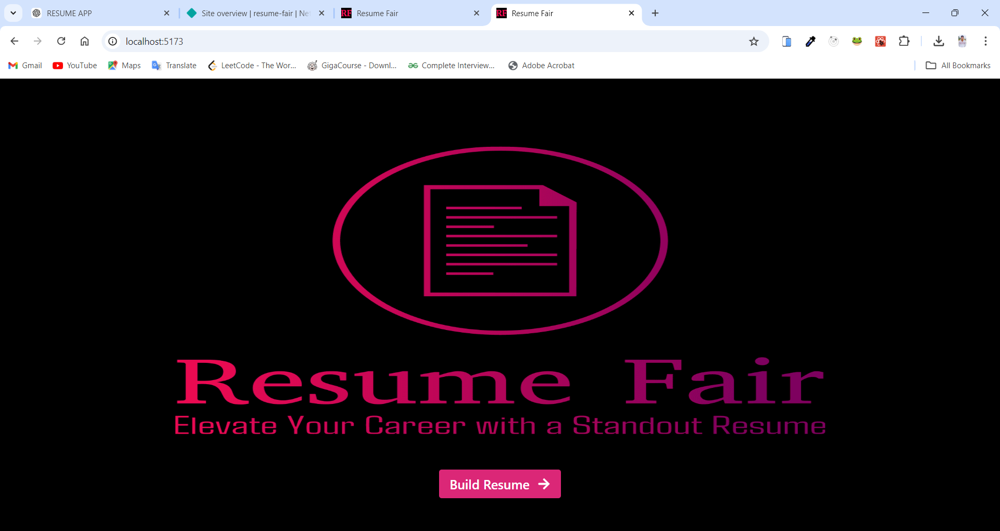
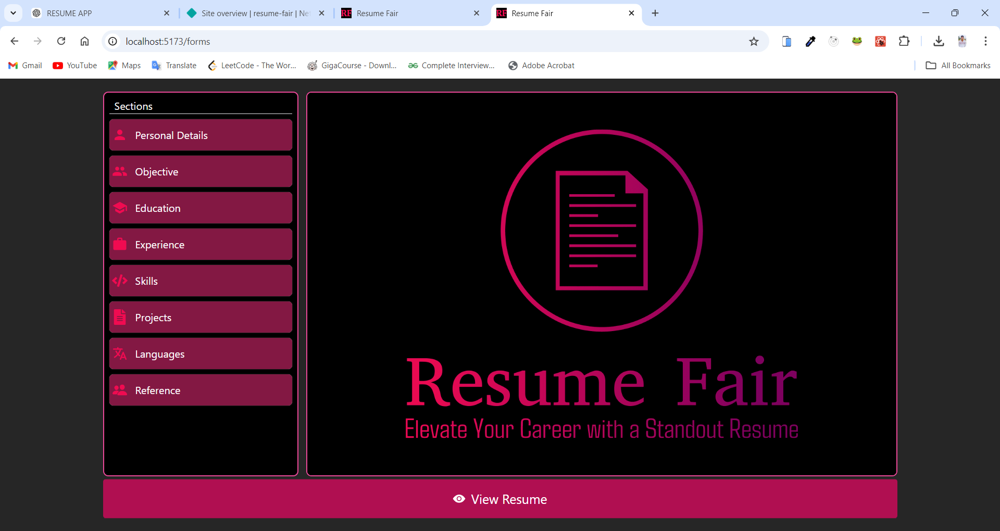
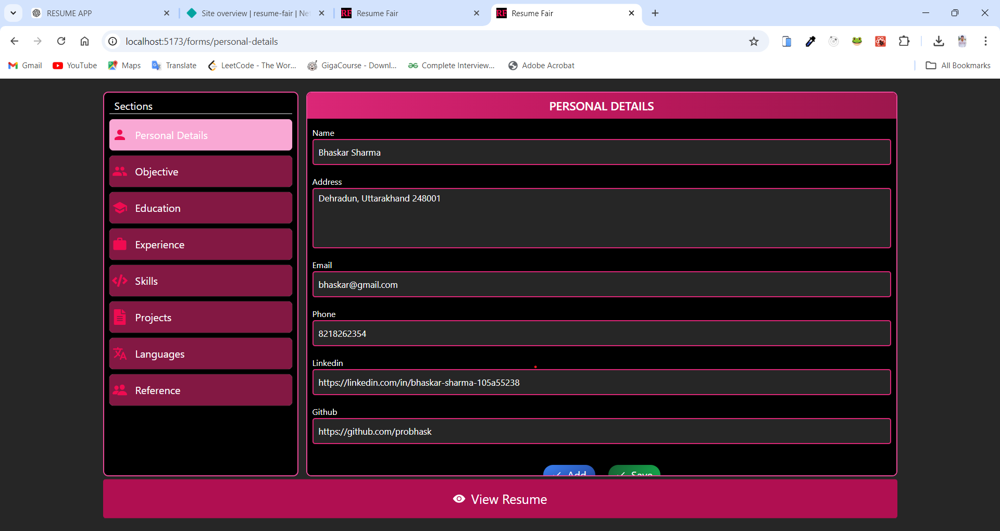
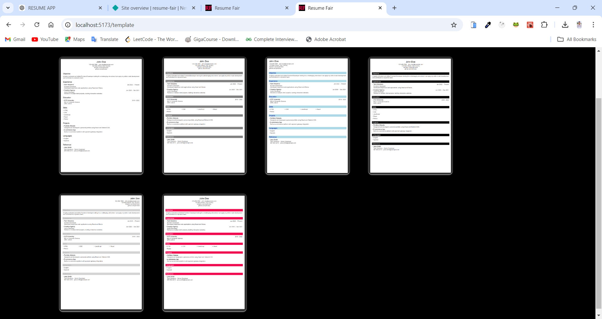
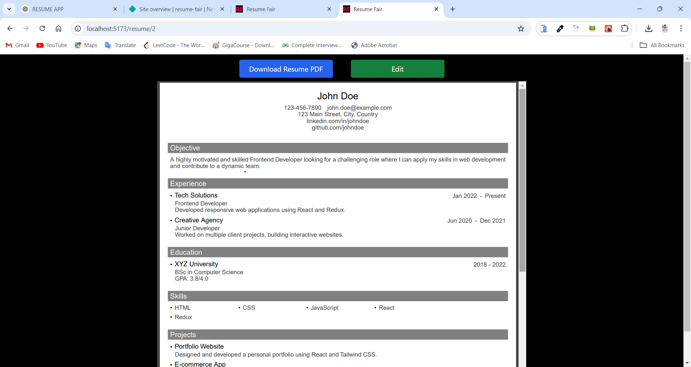
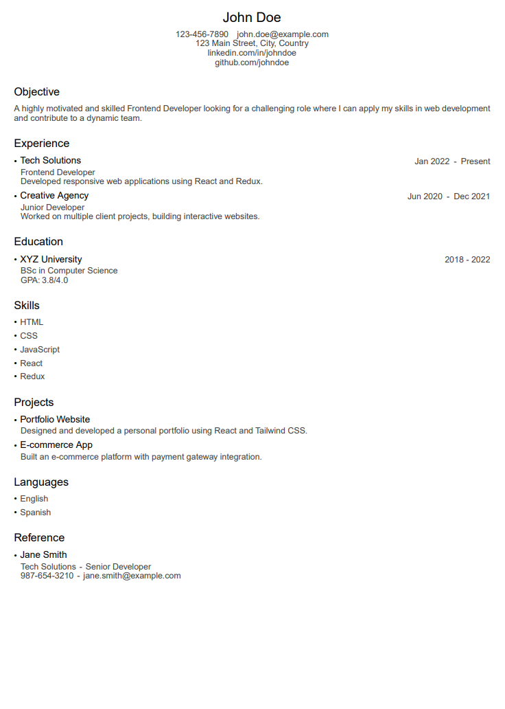
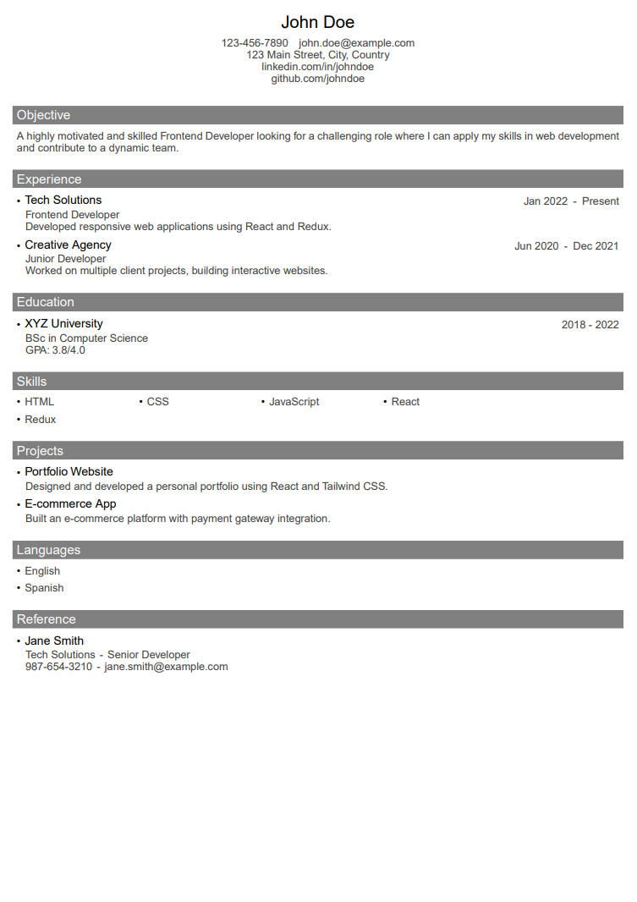
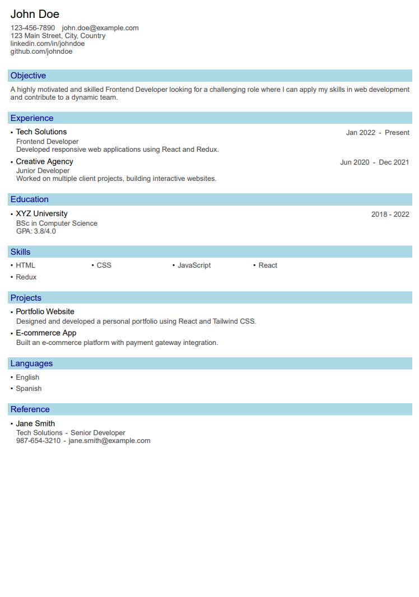

# Resume Fair

## Table Of Contents
- [Resume Fair](#resume-fair)
  - [Table Of Contents](#table-of-contents)
  - [Introduction](#introduction)
    - [Features](#features)
  - [Technologies Used](#technologies-used)
  - [Components Overview](#components-overview)
    - [Resume Components](#resume-components)
    - [Form Components](#form-components)
    - [Error Handling](#error-handling)
  - [PDF Generation](#pdf-generation)
  - [Website Preview](#website-preview)
  - [Templates](#templates)
  - [How to Run the Project](#how-to-run-the-project)
  - [Future Enhancements](#future-enhancements)

## Introduction
This project is a **Resume Builder App** developed using React, TypeScript, and `@react-pdf/renderer`. The app allows users to input their personal details, education, experience, skills, and other information, and generates a resume in PDF format using customizable templates.





### Features
- **Customizable Resume Templates**: Users can select from multiple templates to generate their resume.
- **Dynamic Form Fields**: Add personal details, education, work experience, and more.
- **Error Handling**: Built-in error boundaries and error elements ensure a smooth user experience.
- **PDF Generation**: Users can preview their resume in PDF format and download it.
  
## Technologies Used
- **React**: The app is built with React, making it highly interactive and modular.
- **TypeScript**: For static type checking and improving code quality.
- **Vite**: Used as the build tool for fast development and optimized production builds.
- **@react-pdf/renderer**: A library used for rendering PDFs directly in React.
- **Error Boundaries**: Custom error boundaries have been implemented to handle and display errors gracefully.
  
## Components Overview
### Resume Components
- `ResumePDF.tsx`: The core component responsible for rendering the resume in PDF format using the user's input.
- `ResumeStyles.tsx`: Defines all the styles for the PDF document, ensuring that the resume is visually appealing.

### Form Components
- `InputText.tsx`, `InputTextArea.tsx`: Reusable form elements for user inputs.
- `AddButton.tsx`, `SaveButton.tsx`: Components to handle adding and saving form data.
  
### Error Handling
- `ErrorBoundary.tsx`: A boundary that catches JavaScript errors in the app and displays a fallback UI.
- `ErrorElement.tsx`: Displays a custom error message when something goes wrong.
  
## PDF Generation
The @react-pdf/renderer library is used to generate PDF documents. The app dynamically applies user input data to customizable templates, allowing users to download a professionally styled resume.

## Website Preview









## Templates





## How to Run the Project
1. Clone the repository
```bash
git clone https://github.com/probhask/resume_fair.git
```

2. Install Dependencies

```bash
npm install
or
yarn install
```

3. Run the Development Server

```bash
npm run dev
or
yarn dev
```

This development server will start, and you should see output indicating the server is running.

4. Open the Application

Open your browser and navigate to the local URL provided by Vite development server to view React Application


## Future Enhancements
- Add more customizable templates.
- Allow users to upload their own template designs.
- Add support for multi-page resumes.