# Resume Fair

A **resume builder** built with React, TypeScript and `@react-pdf/renderer`. Fill in
your details, pick from 8 layouts modelled on well-known resume designs, tune the
colour / fonts / spacing, and download a print-ready PDF. Everything runs in the
browser — no account, no server.

**Live:** [resume-fair.netlify.app](https://resume-fair.netlify.app/)

## Table of Contents
- [Templates](#templates)
- [Screens](#screens)
- [Features](#features)
- [Tech Stack](#tech-stack)
- [Project Structure](#project-structure)
- [Running Locally](#running-locally)
- [Roadmap](#roadmap)

## Templates

Eight distinct layouts (recolour, change fonts and spacing on the preview screen).
Previews below are rendered from the actual templates with sample data.

| | | | |
|:---:|:---:|:---:|:---:|
| 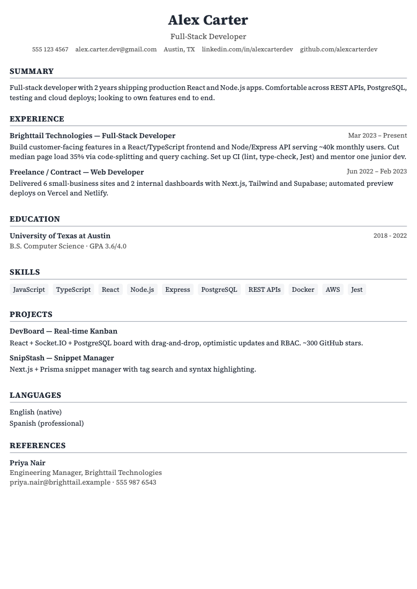 | 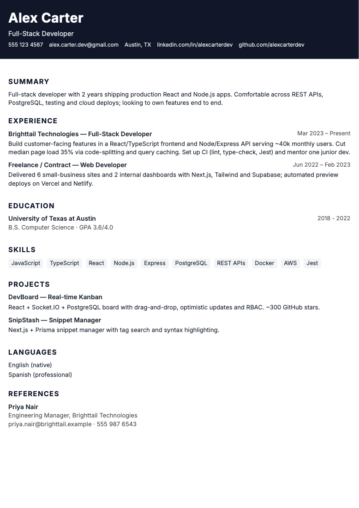 | 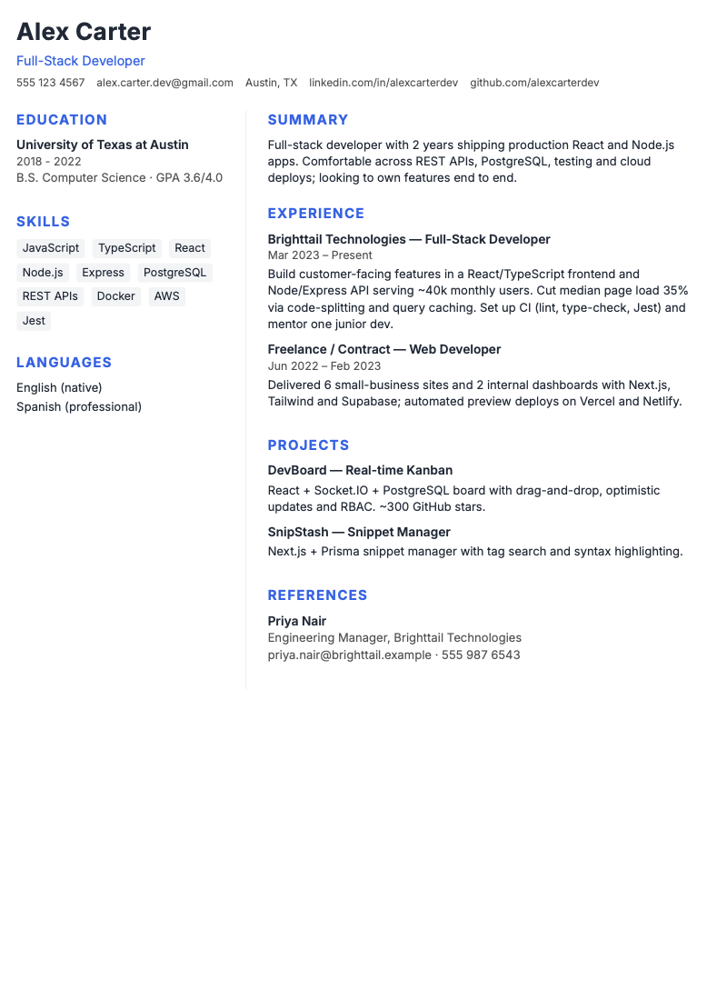 | 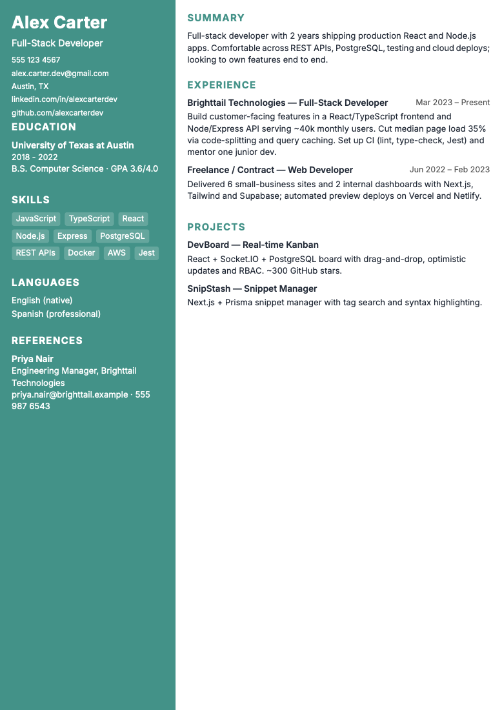 |
| **Classic** — Harvard-style serif, ruled headings | **Executive** — full-width header band, uppercase headings | **Modern** — Deedy-style two-column | **Cascade** — colour sidebar with photo |
| 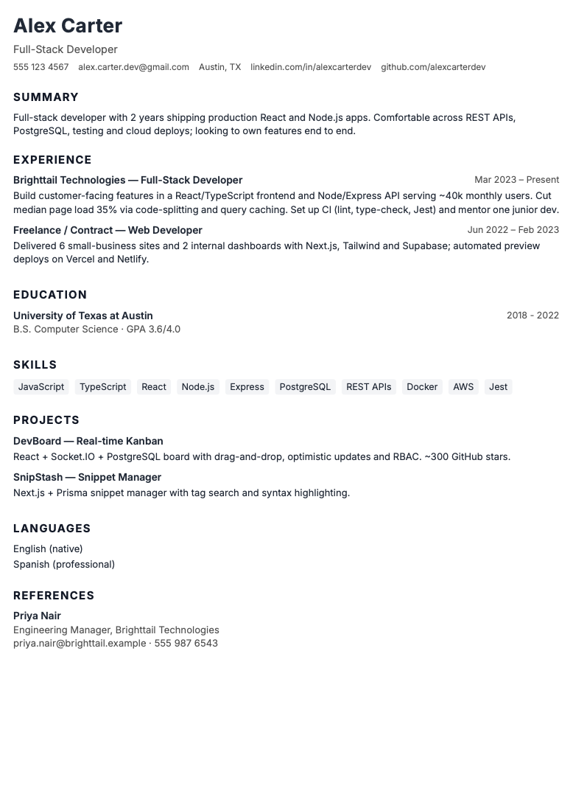 | 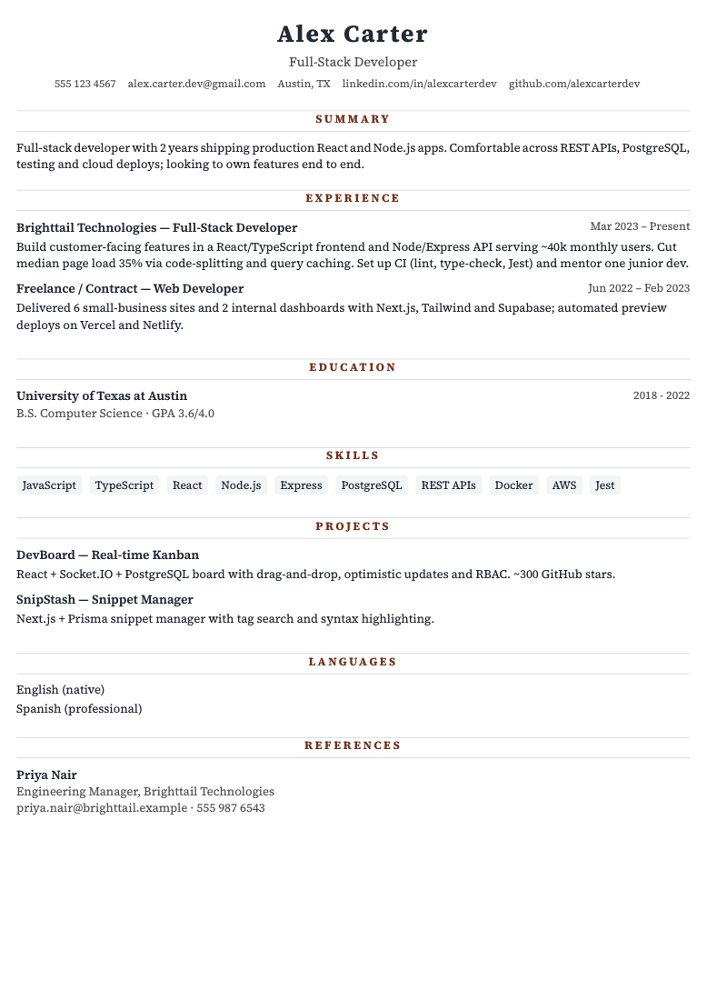 | 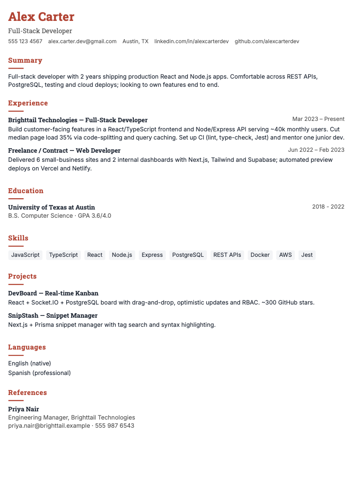 | 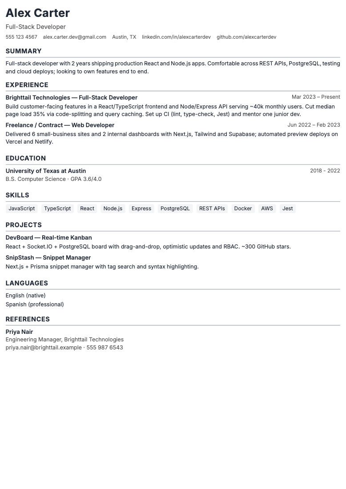 |
| **Minimal** — ATS-plain, one typeface | **Elegant** — centered small-caps serif | **Awesome-CV** — slab accent name and headings | **Compact** — tight margins, one page |

Regenerate these previews after changing a layout:

```bash
npm run gen:templates
```

## Screens

| Welcome | Form | Personal details |
|:---:|:---:|:---:|
| 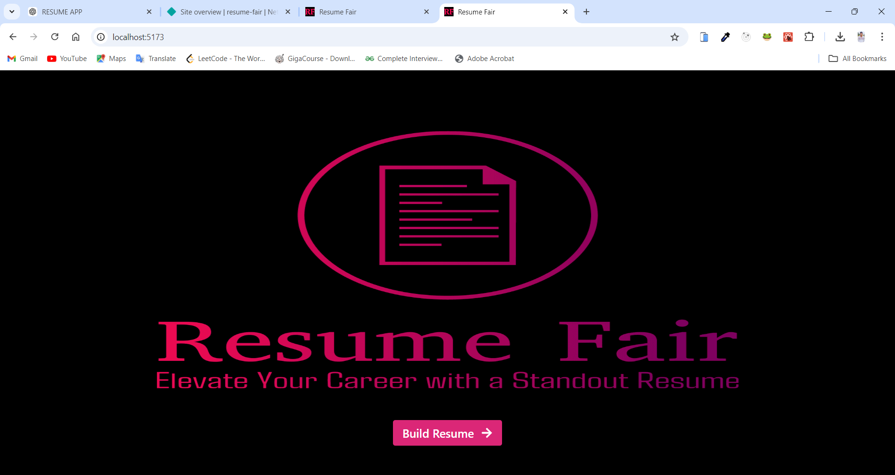 | 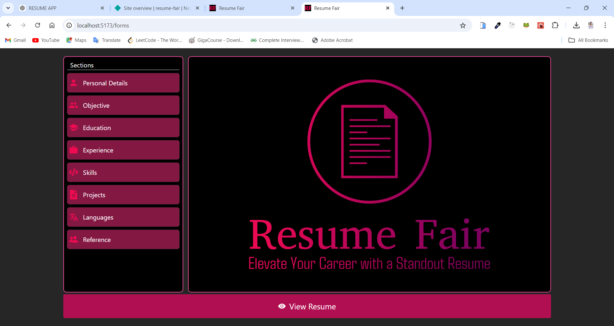 | 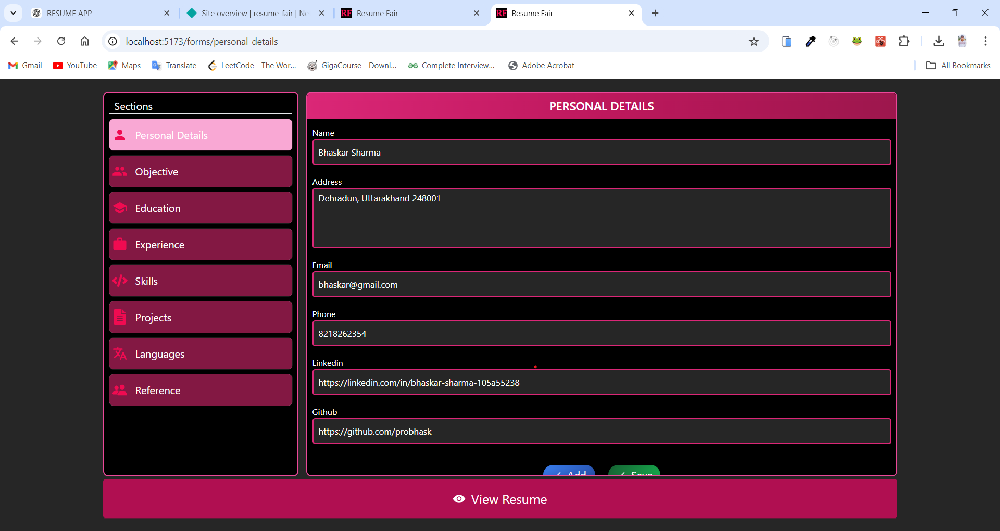 |

## Features

- **8 real layouts** — single-column, header-band, two-column and sidebar, each with
  its own font pairing and heading style (not just a colour swap).
- **Live design controls** — accent colour, font size, page margin and line height,
  applied to the PDF preview in real time.
- **Dynamic sections** — personal details, summary, experience, education, skills,
  projects, languages and references, each with add / remove.
- **Autosave** — every change is written to `localStorage`; a toast confirms saves.
- **PDF export** — preview and download a print-ready A4 PDF.
- **Offline** — no backend, no sign-in; your data never leaves the browser.

## Tech Stack

| | |
|---|---|
| **Framework** | React 18 + TypeScript, Vite |
| **State** | Zustand (per-resume store with debounced autosave) |
| **Forms** | Formik + Yup |
| **PDF** | `@react-pdf/renderer` with self-hosted Inter / Source Serif 4 / Roboto Slab |
| **UI** | Tailwind CSS, `react-hot-toast` |
| **Testing** | Vitest + Testing Library |

## Project Structure

```
src/
  store/useResumeStore.ts        Zustand store — the active resume + actions
  services/storage.ts, migrate.ts  per-resume localStorage, legacy-blob migration
  types/resume.ts                Resume + Template schema
  constants/Templates.ts         the 8 template definitions
  components/ResumePDF/
    ResumePDF.tsx                 dispatcher: resume -> layout
    buildStyles.ts               StyleSheet from template + settings
    sections.tsx                  per-section PDF renderers
    layouts.tsx                   SingleColumn / HeaderBand / TwoColumn / Sidebar
    registerAppFonts.ts           Font.register for the bundled TTFs
  features/Home/*                 form sections
  pages/
    WelcomePage, Home            landing + form shell
    ChooseTemplate               template gallery
    ResumePreview                preview + design sidebar
scripts/
  render-templates.tsx           render every template to a PDF
  gen-templates.sh               + rasterise to public/template/<id>.png
```

## Running Locally

```bash
git clone https://github.com/probhask/resume_fair.git
cd resume_fair
npm install
npm run dev
```

Then open the URL Vite prints. Other scripts: `npm run build`, `npm test`,
`npm run gen:templates`.

## Roadmap

- Side-by-side editor with live preview
- Drag-to-reorder and show / hide sections
- Custom sections (certifications, awards, …)
- Multiple resumes + JSON import / export
